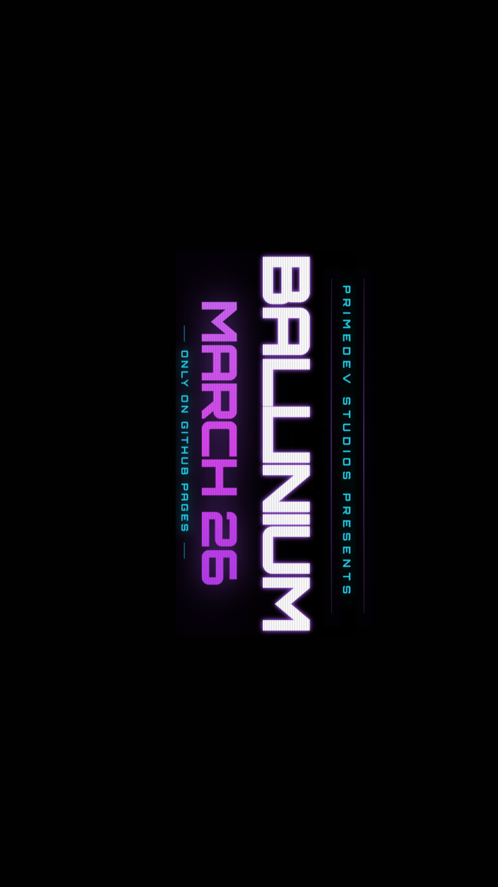

  

  # BALLINIUM // ASCENDED

  **A physics-based strategic simulation game by PrimeDev Studios.**
  
  
  
  

 

## 🪐 WHAT IS BALLINIUM?
**Ballinium // Ascended** is a cutting-edge, browser-based strategic simulation game. Players are thrust into an immersive, neon-drenched interface where they must manipulate physics and momentum to conquer intricately designed sectors. Utilizing tools like Reflectors, Accelerators, and Gravity Wells, the objective is to calculate the perfect trajectory to overcome each unique challenge. 

Every level demands logic, precision, and spatial reasoning, wrapped in a retro-futuristic, scanline-heavy aesthetic designed to echo the golden age of arcade puzzle games—evolved for the modern web.

## ⚡ CORE FEATURES
* **Dynamic Physics Gameplay:** True-to-life trajectory calculations governing velocity, momentum, and gravity.
* **Strategic Arsenal:** Deploy a variety of distinct tools (Reflectors, Accelerators, Gravity Wells) to alter the simulation environment.
* **Campaign & Sandbox Modes:** Ascend through a fully curated campaign progression system, or experiment limitlessly in the freeform Sandbox mode.
* **Atmospheric UI/UX:** High-fidelity CRT monitor effects, bespoke micro-interactions, and a custom ambient soundtrack.
* **Responsive Architecture:** Seamlessly scales from desktop monitors down to mobile viewports without sacrificing the intentional minimalism of the core UI.

## 🚀 RELEASE DATE
**Ballinium // Ascended** officially launches on **March 26**.

## 🔗 TRANSMISSION LINKS
* **[>> INITIATE SYSTEM: Play Ballinium Here <<](https://leoprimesmatrix.github.io/Ballinium/)**
* **Explore the PrimeDev Archives:** **[Play other PrimeDev Studios Games](https://github.com/leoprimesmatrix)**

---

  <i>"Reduction is the ultimate sophistication."</i> — <b>PrimeDev Studios</b>

